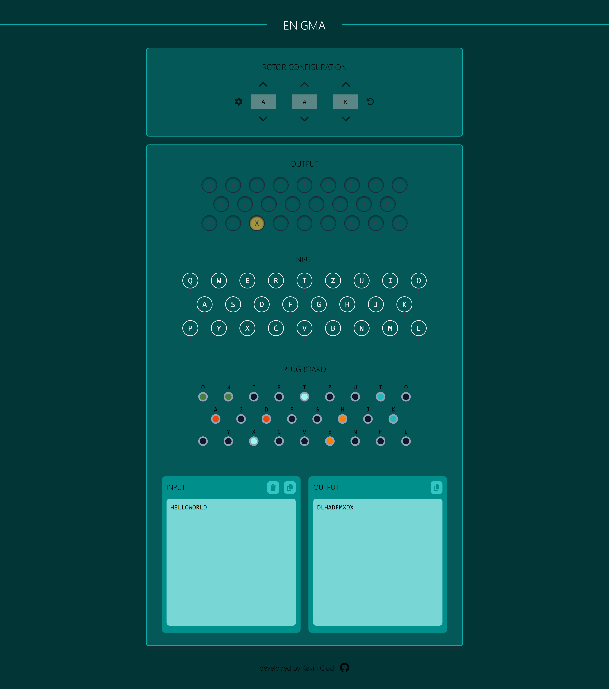

<h1 align="center">
  ENIGMA 🔐
  <p style="font-style: italic ">An Interactiv Web-Simulator</p>
</h1>

This project features a fully interactive basic implementation of the Enigma machine with customizable rotor and plugboard configurations, keyboard input with visual key lamp output and acoustic feedback for an immersive experience. Includes text areas for quick input/output, enabling fast copy-paste operations and easy comparison of encrypted and decrypted messages. Perfect for exploring the workings of the iconic cipher machine.

# Live Demo

You can see the application in action by checking out the [live demo](https://enigma.kevincioch.com).

# Screenshot

<div align="center" style="display: flex; justify-content: center; flex-wrap: wrap; gap: 2em">
  
</div >

# Features

- Interactive web-based simulator of the Enigma machine
- Customizable rotor configuration
- Selection of different Enigma models
- Configurable plugboard for advanced cipher customization
- Keyboard input with real-time visual key lamp output
- Acoustic keystroke feedback 
- Textareas for input and output to facilitate quick copy-paste and message comparison.

# Requirements

- NodeJS

# Setup

```bash
# 1. Clone repository
$ git clone https://github.com/kecioch/enigma

# 2. Navigate into repository
$ cd enigma

# 3. Install dependencies
$ npm i

# 4. Start in devmode
$ npm start
```

# Technologies

- [React](https://reactjs.org/)
- [Tailwind](https://tailwindcss.com/)
